# Cinematic Reading Experience V3 — 视觉呈现与导演设计文档

> **文字是骨骼。音乐是血液。星空是呼吸。色彩是体温。**
> 读者以为自己在"理性地阅读"，但其灵魂已被感官通道悄悄支配。本系统是**图书呈现导演（Book Presentation Director）**用来操纵读者情绪起伏、制造灵魂共振的终极感官控制盘。

---

## 导演的核心使命：感官与理性的双轨运行
在传统的数字化阅读中，文字承担了所有的叙事压力。而在本系统中，文字保持绝对的冷峻、客观与理性，拒绝任何煽情性词汇；**所有的情感张力、空间跨度以及灵魂震撼，全部通过音乐、星云、星空的变化以及页面位移等感官通道（Sensory Channels）来完成。**

呈现导演的任务就是通过配置不同的视觉与声音参数，在特定的段落点燃读者的情绪，引导读者在潜意识中完成从“平静思考”到“好奇探索”，再到“震撼敬畏”，最终“沉入永恒”的心理转换（Mood Swing）。

---

## 目录
1. [空间布局与画布变换 (Layout & Transformations)](#1-空间布局与画布变换-layout--transformations)
2. [星空动力学控制 (Starfield Control Mechanism)](#2-星空动力学控制-starfield-control-mechanism)
3. [星云与空间体温 (Cosmic Nebula & Color Temperature)](#3-星云与空间体温-cosmic-nebula--color-temperature)
4. [声学环境设计 (Acoustic Control Mechanism)](#4-声学环境设计-acoustic-control-mechanism)
5. [文字排版与阅读速度阀 (Typographical Control)](#5-文字排版与阅读速度阀-typographical-control)
6. [章节转场机制 (Transition Systems)](#6-章节转场机制-transition-systems)
7. [导演剧本指南 (Director's Playbook)](#7-导演剧本指南-directors-playbook)
8. [性能与技术指标 (Performance & Technical Specs)](#8-性能与技术指标-performance--technical-specs)

---

## 1. 空间布局与画布变换 (Layout & Transformations)

呈现导演必须首先理解页面在垂直维度上的空间深度设计。画布不再是局限在屏幕内的一张静态图片，而是一个高达 **400vh**、在后台随着滚动进行物理位移的“深空窗口”。

```mermaid
graph TD
    A[400vh 巨大星空画布] --> B["Space 空间视区 (translateY -100vh)"]
    A --> C["Transition 盲区 (translateY -200vh)"]
    A --> D["Earth 山顶视区 (translateY -300vh)"]
    style B fill:#1a3a5f,stroke:#333,stroke-width:2px
    style D fill:#2d1a4f,stroke:#333,stroke-width:2px
```



### 1.1 画布纵向行程与防畸变设计
- **400vh CSS 高度与 translateY(-100vh) 初始化**：为了支持在“深空（Space）”与“山顶（Earth）”两个完全不同的叙事场景之间进行平滑的纵向长距离旅行，Canvas 被拉伸至 `400vh`。
- **宽高比锁定**：Canvas 内部渲染分辨率在 `resize` 中同步设置为 `window.innerHeight * 4`。这保证了在纵向旅行过程中，画布不会被垂直挤压或变形，所有恒星始终保持完美的圆形长宽比（Aspect Ratio）。
- **空间定位**：
  - **Space (太空模式)**：画布向上平移 `-100vh`。此时视口展现的是画布 `[100vh, 200vh]` 之间的深空。
  - **Earth (山顶模式)**：画布向上平移 `-300vh`。此时视口展现的是最底部的深空，同时叠加前景中的山脉（Mountain Overlay）。

### 1.2 深空底色与胶片颗粒质感
- **非纯黑渐变底色**：真正的深空不是纯黑。导演通过 CSS 四重径向与线性渐变叠加，营造出极微弱的偏角温度差。
  ```css
  background: 
      radial-gradient(ellipse at 20% 30%, rgba(8, 6, 18, 1) 0%, transparent 50%),
      radial-gradient(ellipse at 80% 70%, rgba(6, 10, 16, 1) 0%, transparent 50%),
      radial-gradient(ellipse at 50% 50%, rgba(5, 5, 12, 1) 0%, transparent 70%),
      linear-gradient(180deg, #040408, #060510, #050508, #080610);
  ```
- **非对称电影级暗角**：径向渐变中心偏向左上（40% 35%），避开完美的几何对称，制造电影画幅的呼吸感。
- **胶片噪点纹理**：引入 3.5% 不透明度的分形噪声纹理（基于 SVG `feTurbulence`），消除数字纯色带来的廉价平滑感，赋予夜空如 IMAX 胶片底片般的颗粒粗糙度（Film Grain）。

---

## 2. 星空动力学控制 (Starfield Control Mechanism)

星空是宇宙的“呼吸”。通过控制星空的运动轨迹、速度和闪烁概率，呈现导演可以调控空间给读者的压迫感或平静度。

### 2.1 三层深度视差 (3D Parallax Depth)
导演将恒星划分为三个深度图层，通过 **1:25 的极大速度差** 创造视差，让平面屏幕产生深邃的三维空间深度：

| 图层 (Layer) | 数量占比 | 速度倍率 | 亮度倍率 | 大小倍率 | 渲染模式 | 叙事暗示 (Director's Hint) |
| :--- | :--- | :--- | :--- | :--- | :--- | :--- |
| **far (远景星)** | 45% | 0.1x | 0.4x | 0.35x | 柔光渐变 (微失焦) | 亿万光年外冷漠凝视的星海背景 |
| **mid (中景星)** | 37% | 0.6x | 0.85x | 0.9x | 轻微边缘模糊 | 肉眼可见的正常夜空主体 |
| **near (近景星)** | 18% | 2.5x | 1.3x | 2.0x | 锐利高亮实心圆 | 飞掠视口的近身恒星，速度与方向的强暗示 |

### 2.2 恒星物理特征与闪烁算法
- **幂律大小分布 (Power-Law Distribution)**：不采用简单的随机数，而是模拟真实的恒星物理亮度分布——极少数明亮巨大的近星，绝大多数是极小的微弱星点。
- **Perlin 三频噪声闪烁 (Twinkles)**：
  $$\text{scintillation} = \text{noise}(t) + 0.5 \cdot \text{noise}(t \times 2.3) + 0.25 \cdot \text{noise}(t \times 5.1)$$
  通过三个不同频率的噪声波叠加，真实模拟地球大气湍流造成的恒星不规则闪烁（Scintillation），取代机械的三角函数正弦波动。
- **衍射光芒 (Diffraction Spikes)**：当大星（`baseRadius > 1.5`）随机触发闪耀（`flareActive`）时，Canvas 会绘制 **JWST（韦伯太空望远镜）风格的六角十字光芒**，以及围绕星核的微弱圆形光晕（Radial Halo Glow），瞬间拉满仪轨感与神圣感。

### 2.3 宏大离轴自转 (Off-Screen Majestic Rotation)
当导演调用 `clockwise`（顺时针）或 `anticlockwise`（逆时针）模式时，为了表现空间的**无垠性与宏大尺度**，星空摒弃了常规的居中自转，而是围绕一个**极其遥远的离轴中心**转动。

```
                     [ 视口 Viewport ] 
                        (  sweeping )
                       /             \
                      /               \
                     /                 \
                    /                   \
                   /                     \
[ 离轴旋转中心 Pivot ] (cxRot: -40% width, cyRot: cyViewport + 200% height)
```

- **超大旋转半径**：旋转中心设在视口左下方 `cxRot = -width * 0.4`，`cyRot = cyViewport + window.innerHeight * 2.0`。这意味着恒星以约 **2700px 的巨大半径** 沿着优美的对角弧线扫过读者的屏幕。
- **庄严而缓慢的角速度**：由于旋转半径巨大，如果使用普通的角速度会导致恒星飞速划过，破坏平静感。角速度增量被限制在：
  $$\Delta \theta = \text{activeSpeed} \times 0.004 \text{ radians/frame}$$
  这使得恒星在屏幕上的线性扫动极其平缓、厚重（约一分钟跨越屏幕），展现星系运转的庄严力量。
- **动态扇形生成区**：系统只在围绕当前视口的 **120度激活角扇形区域** 内生成并 bounds-check 循环恒星。这极大地保证了渲染效率，同时无论读者如何无限滚动，视野内的星尘永远保持均匀饱满的密度，不会出现视觉死角。

---

## 3. 星云与空间体温 (Cosmic Nebula & Color Temperature)

星云的色彩是夜空的“体温”。通过控制星云的亮度和色温，呈现导演可以直接作用于读者的感性直觉，绕过其理性的防御。

### 3.1 6层微结构叠合系统
每个 Mood 的星云都由 6 个分层 DOM 容器组成，拥有不同的不透明度、模糊度（`25px - 140px`）和旋转速度。它们互相交织，营造出极具物质感和流动感的宇宙云团：

| 层级 | 角色 | 模糊半径 (Blur) | 作用 |
| :--- | :--- | :--- | :--- |
| **a1** | 核心主体 | 55px–70px | 渲染当前情绪对应的底色云块，面积最大。 |
| **a2** | 局部副体 | 45px–55px | 在不同象限增加第二种对比色，丰富云块层次。 |
| **a3** | 边缘扩散 | 70px–90px | 柔化云团边缘，使其与深空渐变底色无缝交融。 |
| **a4** | 暖色口袋 | 40px–50px | 模拟 JWST 风格的明亮暖金色/粉色气体聚集区。 |
| **a5** | **丝状结构** | **25px–40px** | 窄条长条的微弱发光丝带，引导视觉流向。 |
| **a6** | 深层包络 | 110px–140px | 极低不透明度的宏大包络层，给黑色背景提供温和的色晕。 |

### 3.2 有机扭曲滤镜 (SVG Fractal Noise Warp)
为了彻底告别 CSS 渐变带来的规整椭圆形色块，导演在底层部署了基于 SVG Fractal Noise 的位移映射滤镜：
```html
<filter id="nebula-warp-1">
    <feTurbulence type="fractalNoise" baseFrequency="0.012" numOctaves="4" result="noise"/>
    <feDisplacementMap scale="45" in="SourceGraphic" in2="noise" xChannelSelector="R" yChannelSelector="G"/>
</filter>
```
该滤镜通过提取分形噪声的红绿通道值对星云边缘实施有机的扭曲，模拟流体动力学在太空中撕扯气体星云的边缘锯齿，使其呈现出纤维状、撕裂状的云雾肌理。

### 3.3 缓慢光流呼吸 (Opacity Breathe)
所有星云层均搭载不透明度微幅振荡效果，其脉动周期（`8s - 40s`）直接反映当前的叙事压迫力。Awe 状态下呼吸周期仅为 `8s`（宇宙在激荡），而在 Weight 状态下呼吸周期拉长到 `25s` 以上（宇宙正渐渐冷却、死寂）。

---

## 4. 声学环境设计 (Acoustic Control Mechanism)

声音是体验的“血液”。文字无法说出的千言万语，通过低电平、高穿透力的氛围声学（Ambient Music）直达心灵。

- **最大音量限制**：全局音量阈值设在 `0.28`，确保音乐充当温和的背景底色，而不喧宾夺主。
- **5秒余弦余波淡入淡出 (Sine-Easing Crossfade)**：当读者滑动进新的 Mood 区时，触发音乐平滑切换。旧音轨缓慢 fade out，新音轨在 **0.8秒后** 以优雅的余弦包络线（Cosine Envelope）逐步淡入，避免了突兀切歌打破读者的沉浸感。
- **声学映射矩阵**：
  - **Calm** ➔ *Snowfall* (Scott Buckley)：偏向客观、冷冽的钢琴与弦乐。用于逻辑论证前言或总结，使读者理智冷静。
  - **Wonder** ➔ *Filaments* (Scott Buckley)：带有明亮的拨弦与环境音垫。用于逻辑推进和产生好奇心。
  - **Awe** ➔ *Horizons* (Scott Buckley)：层层推进的宏大交响乐与管风琴元素。用于海量数据 Converge 的论证高潮。
  - **Weight** ➔ *Escape* (Sappheiros)：低沉、空灵、充满无法逃避的深重重力感。用于章节尾声和永恒终局。

---

## 5. 文字排版与阅读速度阀 (Typographical Control)

呈现导演通过双重字体排版、学术审计表格以及互动参考文献卡片，构建了一个既充满情感张力又具有临床严肃性的文字系统。通过操纵文字的入场动画与显示速度，作为“隐形速度阀（Speed Bumps）”，强行调整读者浏览文本的脑波频率。

### 5.1 视觉双轨字体系统 (Dual-Font System)
为了让阅读体验在“理性辩证”和“感性敬畏”之间形成对照，系统使用了两套经过精选的 Google Fonts 中文字体：
- **思源黑体 (Noto Sans SC)**：用于**主干说理文本**。其字形扁平、客观、现代、无感情色彩，适合冷静理性的临床报告、逻辑推演以及数据陈列。
- **思源宋体 (Noto Serif SC)**：用于**大标题、过渡引导词、核心金句、离体视觉描述以及永恒对话部分**。其笔画带有传统的雕刻感与人文温度，古朴而庄严，能强力唤起读者对神圣感、历史感以及终极奥秘的向往。

在 CSS 中，导演通过变量形式定义，并为标题和主要引用块绑定：
```css
:root {
    --font-sans: 'Noto Sans SC', sans-serif;
    --font-serif: 'Noto Serif SC', serif;
}
body { font-family: var(--font-sans); }
h1, h2, h3, blockquote, .highlight, .chapter-label { font-family: var(--font-serif); }
```

### 5.2 速度控制与文字特效矩阵
文字并不是在页面上静止等待，而是随着读者滑动，在恰当的呼吸点浮现：

| 动画名称 (Class) | 动画触发点 | 速度与延迟 | 导演意图 (Director's Intent) | 适用场景 |
| :--- | :--- | :--- | :--- | :--- |
| **`fx-glow`** | 进入视口 | 渐现后触发 3.5 秒蓝白光脉冲 | 制造视线强行锚定，让字句带有磁性与光芒。 | 每个小节中最关键的一句结论（核心骨骼）。 |
| **`fx-fade-up`** | 进入视口 | 向上滑移 25px，渐显 | 舒缓、自然流淌的排字流。 | 普通叙事段落或说明性文本。 |
| **`fx-typewriter`** | 进入视口 | 逐字打字机效果 (50ms/字) | **强力制动器**。打破速读习惯，迫使读者一字字咀嚼。 | 重大转折点、灵魂质问、不可忽略的逻辑节点。 |
| **`fx-reveal`** | 进入视口 | 逐字/逐词渐显 (120ms/字) | 具有庄严的揭示感。中国字按单字，英文按空格分词。 | 宣布最终真理、展示特殊专有名词或圣名。 |
| **`fx-quote`** | 进入视口 | 缩放入场 + 左边框呼吸发光 + 浅紫毛玻璃背景 | 建立神性祭坛般的视觉质感。 | 核心经典引言（Blockquote）呈现。 |

### 5.3 临床审计表格设计 (Cinematic Glassmorphic Tables)
本书包含大量严谨的研究数据，表格必须打破传统网页的呆板样式。导演设计了具有**深空质感的多维对比矩阵**：
- **微光毛玻璃容器**：表格外层包裹着带透明边框的容器，叠加极弱的白光背投阴影，与太空背景自然叠加，文字具有悬浮感。
  ```css
  .table-container {
      background: rgba(10, 10, 15, 0.4);
      backdrop-filter: blur(8px);
      border: 1px solid rgba(255, 255, 255, 0.08);
      box-shadow: 0 10px 30px rgba(0, 0, 0, 0.4);
  }
  ```
- **表头学术庄严感**：表头全部采用小字号、高字距、全大写，配合 `border-bottom: 2px solid rgba(255, 255, 255, 0.12)` 强化审计表格的严肃性。
- **隔行换色与悬停流光**：偶数行自动填充 `rgba(255, 255, 255, 0.01)` 极弱背景。当读者鼠标悬停或滑动过某行时，该行底色以 `0.2s` 渐变为 `rgba(255, 255, 255, 0.04)` 并高亮文字，引导视线对齐。

### 5.4 互动参考文献系统 (Interactive Reference System)
为了解决严肃的科学出处打断阅读流的难题，导演舍弃了传统的页脚注释，开发了**滑移参考文献卡片系统**：
- **微弱 dashed 锚点 (`.ref-tag`)**：在正文中以 `[NDEXP-001]` 的形式微小呈现，采用浅冰蓝 monospace 字体。当鼠标悬停时轻微泛光，暗示可点击。
- **滑移抽屉底板 (`.ref-panel`)**：点击锚点时，一个半透明的高斯模糊抽屉从屏幕底部滑升出（最大高度 `320px`），卡片上清晰地分列：作者、出版物、年份、文献类型以及该项研究在本书中的“具体论证用途”。读者点击卡片外部或按 `ESC` 即可让卡片滑落，重回阅读沉浸状态。

---

## 9. AI 章节生成与排版转换指南 (AI Auto-Styling Reference Guide)

> [!TIP]
> **本章节是为后续 AI 助手排版新章节时设计的“样式参考指南”。**
> 当未来的 AI 接收到一个 restructured 的 markdown 文本并准备将其排版为 HTML 时，**必须严格遵守以下映射规则**，以保持整本书视觉风格的绝对统一。

### 9.1 Markdown 元素到 HTML/CSS 类名的映射矩阵

| Markdown 语法 | 对应 HTML 结构 | 绑定 CSS 类名 / 动画效果 | 排版要求与导演意图 |
| :--- | :--- | :--- | :--- |
| `# 标题` | `<h1>标题</h1>` | 位于 Big Bang Reverse 遮罩层中 | 仅用于章节正中心的创世大标题，带有 `.bigbang-heading`。 |
| `## 标题` | `<h2>标题</h2>` | `.fx-fade-up` | 普通节级大标题，底部带 1px 细边框，字体为思源宋体。 |
| `### 标题` | `<h3>标题</h3>` | `.fx-fade-up` | 普通小节标题，颜色略带灰白，不带边框。 |
| `*文本*` (段首/行末) | `<p class="next-chapter">*[文本]*</p>` | `.fx-fade-up` | 导演预留的“继续深入”引导词，带有右箭头，斜体，极淡灰蓝色。 |
| `> 核心引用` | `<blockquote class="fx-quote">` | `.fx-quote` | 页面最核心的逻辑支柱或全称命题，入场时带缩放和左侧微光渐显。 |
| `> 普通引用` | `<blockquote>` | 无 (默认样式) | 读者内心疑问或反驳观点。使用普通斜体，左侧极细灰白边框。 |
| `*[关键词]*` | `<strong class="highlight">` | `.highlight .fx-glow` 或 `.fx-typewriter` | 终极核心结论，通常是两三句，用于触发文本的蓝白脉冲发光或打字机。 |
| `[NDEXP-XXX]` | `<span class="ref-tag" data-ref="NDEXP-XXX">` | `.ref-tag` | 临床数据出处锚点。必须注册在 `app.js` 的 `REFS` 数据库中。 |
| `【维度/视角】` | `<div class="lens-block">` | `.lens-block .fx-fade-up` | 视角偏转口袋。内部第一段需带 `.lens-label`（如 `【年轻人视角】`），左侧带棕金发色框线。 |
| 标准 Markdown 表格 | `<div class="table-container"><table>` | `.table-container` | 必须在外层包裹 `.table-container`，以确保高斯模糊背板与手机端横向滚动正常工作。 |

### 9.2 JS 参考文献数据库 (REFS Database) 注册模板
当遇到新的文献时，未来 AI 必须将其添加到 `app.js` 的 `REFS` 常量中。格式如下：
```javascript
'NDEXP-XXX': {
    author: '作者姓名 / 机构名称',
    title: '文献/书籍完整标题',
    source: '发表平台 / 杂志 / 出版社',
    year: '年份',
    type: 'JOURNAL | BOOK | PRIMARY | CASE STUDY',
    used_for: '该研究在本章中起到了什么论证作用（中文描述）'
}
```

### 9.3 AI 排版决策自检清单 (Self-Check Checklist)
1. **是否存在裸文本？**
   - 除了极普通的过渡段落，所有核心观点、标题、列表均应绑定适当的视觉呈现特效（如 `.fx-fade-up` 或 `.fx-glow`）。
2. **文字间距是否足够？**
   - 检查行间距是否为 `line-height: 2.0`。段落间距（`.text-block p`）是否为宽敞的 `1.5rem`。
3. **表格是否自适应？**
   - 检查所有的 `<table>` 是否都在 `div.table-container` 内，避免表格在移动端宽度溢出。
4. **宋黑混排是否符合直觉？**
   - 检查正文说理是否全部为无衬线的思源黑体，标题/结论是否全部为有衬线的思源宋体。
5. **参考文献是否完全可交互？**
   - 检查所有的 `[CHAPTERUID-NNN]` 标识（包含正文论述、表格单元格、以及小节末尾的参考文献/审计声明列表），必须全部包裹在 `<span class="ref-tag" data-ref="CHAPTERUID-NNN">` 标签中，绝不能遗漏任何一个，以确保全书没有“死”文本，全部可点击唤起底部高斯模糊信息面板。

---

## 6. 章节转场机制 (Transition Systems)

在没有文字的章节转折区（100vh 留白区），视觉导演可以释放全部的艺术能量，用纯视觉的宏大动画作为读者的情感清洗区。

### 6.1 章节过渡 A：Lightspeed（超光速飞掠 - 轻量级过渡）
- **视觉寓意**：不是单调的几何拉伸线，而是“宇宙的彻底苏醒”。
- **无感大星剥离**：为了防止大面积星星拉伸成白色糊条破坏三维空间透视，Lightspeed 期间新生成的 700 颗过渡星**全部限制在 0.55px 以下**，且不渲染任何 Halo 与 Spikes。近层小星加速前冲，远层小星微弱加速，维持了真实的星际穿越视差。
- **色彩注入**：过渡星混合了 25% 暖金、15% 薰衣草紫、15% 冰蓝等过渡色彩，星云同步切换到彩色的 `lightspeed` 组。
- **角速度冻结**：在 Lightspeed 期间，自转完全静止，强制将镜头锁定在极速向前的 Z 轴方向上。

### 6.2 章节过渡 B：Big Bang Reverse（宇宙倒带 - 重载创世转场）
用于核心大分区（Part）之间的宏大转场，这是极具宗教与哲学仪式感的视觉震荡序列：

```
[ 宇宙膨胀 (Phase 1) ]  -->  小星向外狂奔，突破屏幕边缘，渲染惊人的速度与尺度
         |
[ 宇宙倒带 (Phase 2) ]  -->  惯性漂移结束后，平滑向内坍缩，星云消退，背景陷入绝对死寂的黑
         |
[ 宇宙坍缩 (Phase 3) ]  -->  所有恒星以指数衰减级速度 collapse 至屏幕中心
         |
[ 奇点诞生 (Phase 4) ]  -->  中心爆发柔和暖白光晕 (最大72% opacity，护眼防刺)，定格为55%灰白底色
         |
[ 创世标题 (Phase 5) ]  -->  文字以打字机与揭示效果显现于柔白色的虚空中
         |
[ 渐暗淡出 (Phase 6) ]  -->  奇点灰白幕布淡出，星空与新章节的星云慢慢复原
```

---

## 7. 导演剧本指南 (Director's Playbook)

这里为呈现导演提供几套预设的情绪剧本，可直接用于编排章节的节奏：

### 剧本 A：标准的解惑与探寻弧线（用于多数说理章节）
```
[Calm (平静思考)]  ➔  [Wonder (疑窦初生，星空上升，Filaments轻响)] 
                        ➔  [Awe (论据 converge，星海汇聚，Horizons爆发)]
                        ➔  [LIGHTSPEED (章节转场)]
                        ➔  [Weight (尘埃落定，星辰徐徐下沉，叹息般结束)]
```

### 剧本 B：强力辩驳与质问弧线（用于驳斥“善人也会下地狱”等尖锐问题）
```
[Wonder (直接引入疑惑)] ➔  [Awe (进入强力辩证，星辰极速扩增，逆时针旋转)]
                         ➔  [Awe (逻辑链收尾，高频闪烁)]
                         ➔  [LIGHTSPEED (情绪缓冲转场)]
                         ➔  [Calm (一切归于深邃的蓝，让读者独自面对结论)]
```

### 剧本 C：大篇章史诗过渡弧线（用于 Part I ➔ Part II 的跨越）
```
[Weight (第一部分沉重结尾)] 
     ➔  [BIG BANG REVERSE (创世坍缩与闪光，显示 "第二部分：为什么我不能自我救赎")] 
     ➔  [Calm (重新以宁静的深空起笔，展开新的探讨)]
```

---

## 8. 性能与技术指标 (Performance & Technical Specs)

即使导演有再伟大的设计，如果掉帧，所有的沉浸感都会在一瞬间彻底瓦解。以下为确保 60fps 满帧运行的技术保障配置：

- **GPU 复合渲染路径**：
  - 星云的旋转与位移全部交由 CSS Keyframes 进行，利用 GPU 合成线程（Compositor Thread）绘制，不占用主线程。
  - 画布位移（`translateY`）采用 `transform: translate3d` 触发硬件加速，避免引起 DOM 重绘（Repaint）。
- **极小星星渲染提速**：
  - 凡是大小小于 `0.4px` 且不带特效的远景星，在 Canvas 中一律使用 `fillRect()` 替代 `arc()` 路径渲染。该优化使高密度星群在移动端的渲染性能提升了 **3 倍**。
- **恒星总上限防线**：
  - 正常星空恒星数量被锁定在 `targetStarCount * 3` 的总数量级。加上 Lightspeed 加速星，整体 Canvas 粒子上限约为 `2100` 个，远低于一般渲染引擎的性能瓶颈线。
- **微像素尘埃层**：
  - 尘埃颗粒在引擎初始化时预先拼贴在离屏 Canvas 中，渲染时只需通过偏移量整体绘制，规避了每帧计算上千个亚像素点物理状态的开销。
- **画质无感降阶**：
  - 遇到低端移动浏览器（不支持feTurbulence），SVG 滤镜将自动优雅降级，改用标准分层 Blur，确保交互流畅度。

---

> “文字走脑，视觉走心，声音走魂。”
> 
> 呈现导演必须时时克制自己的创作欲，不要在文字出现时安排喧宾夺主的动效。文字出现时，一切视觉与听觉都应充当温和的背景；当文字隐去，过渡空白来临时，才是导演肆意挥洒神性笔墨的黄金时刻。
